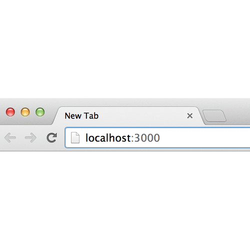

# Intro to Web Frameworks: Express.js
## Routes, Params, and Queries

| Objectives |
| :---- |
| Review and discuss the request and response cycle |
| Describe the parts of an HTTP request and url  |
| Apply routing knowledge to build an express application |

## Pre-reading

* [HTTP Intro](http://code.tutsplus.com/tutorials/http-the-protocol-every-web-developer-must-know-part-1--net-31177)

## Terminology

* HTTP
* TCP
* Resource path
* Query string
* HTTP verb
* Status code
* Network packet
* W3C

## Outline

* Intro to Express
	* A Hello World App
* Routing
	* HTTP GET  
	* Request Params
* Query Params
* Calculator App

##Express Intro (15m)

**Background**

* We already know that [Node.js](https://github.com/sf-wdi-18/notes/blob/master/lectures/week-02/day_3_node/dawn/node-intro.md)
	* **is a tool to run JavaScript outside the browser, directly on your OS.**
* But what is a *web application framework*?
	* **A tool for handling middleware integration, routing, and other relevant concerns.**
* How about [Express](http://expressjs.com/)?
	* **A configurable, minimal web framework for Node.**

###Setup

Let's start with a simple **Express** application.

* Make a directory and `index.js`  
	
	``` bash
	mkdir quick_example
	cd quick_example/
	touch index.js
	```

* Then create a `package.json`, use the first line below or `npm init`.

	``` bash
	echo {} > package.json		#puts an empty object into a new `package.json`
	npm install --save express
	subl .
	```
The folder structure will be as follows:
```
/quick_example
    /node_modules
        /express
            ...
    index.js
    package.json

```

Now we need write some code for our simple application.


`index.js`

``` javascript
// requirements
var express = require('express'),
	app = express();
	
// a "GET" request to "/" will run the function below
app.get("/", function (req, res) {
	// send back the response: 'Hello World'
	res.send("Hello World");
});

// start the server
app.listen(3000, function () {
	console.log("Go to localhost:3000/");
});

```

Now you can start the server: 

``` bash
node index.js
```


###Viewing Our Server 

Go to `localhost:3000` in your browser.

* This sends a request to the server that looks like:
	
	```
	GET / HTTP/1.1
	Host: localhost:3000
	Connection: keep-alive
	Cache-Control: max-age=0
	Accept: text/html,application/xhtml+xml,application/xml;q=0.9,image/webp,*/*;q=0.8
	User-Agent: Mozilla/5.0 (Macintosh; Intel Mac OS X 10_9_5) AppleWebKit/537.36 (KHTML, like Gecko) Chrome/42.0.2311.135 Safari/537.36
	Accept-Encoding: gzip, deflate, sdch
	Accept-Language: en-US,en;q=0.8
	If-None-Match: W/"b-4a17b156"
	```

* The Server sends back something like the following:
	
	```
	HTTP/1.1 200 OK
	X-Powered-By: Express
	ETag: W/"b-4a17b156"
	Date: Mon, 11 May 2015 00:20:24 GMT
	Connection: keep-alive
	
	Hello World
	```

We can verify this with the [cURL](http://curl.haxx.se/) command: `curl -I localhost:3000`.

###A request/response cycle



## Routing

Building an application will require us to have a firm grasp of something we call **routing**.  Each **route** is a combination of a **Request Type** and **Path**. 

| Request Type | Request Path | Response
| :--- | :--- | :--- |
| `GET` | `/` | `Hello World` |
| `GET` | `/burgers` | `Hamburger`, `Cheese Burger`, `Dble Cheese Burger` | 
| `GET` | `/tacos` | `Soft Taco`, `Crunchy Taco`, `Super Taco` |


Let's build these into our application:

`index.js`

``` javascript
var express = require('express'),
	app = express();
	
var burgers = [
				"Hamburger",
				"Cheese Burger",
				"Dble Cheese Burger"
			   ];
			   
var tacos = [
				"Soft Taco",
				"Crunchy Taco",
				"Super Taco"
			   ];
	
app.get("/", function (req, res) {
	res.send("Hello World");
});

app.get("/burgers", function (req, res) {
	//send all the burgers	   
	res.send(burgers.join(", "));
});

app.get("/tacos", function (req, res) {
	//send all the tacos		   
	res.send(tacos.join(", "));
});

app.listen(3000, function () {
	console.log("Go to localhost:3000/");
});

```

## Url Parameters

What if we want to create an app that can dynamically say hello to anyone?

* Using **url parameters** add a dynamic route to the application, indicated by `:` and the variable name you want to use, we'll use `:name` for the example below.

``` javascript
app.get("/greet/:name", function (req, res) {
	res.send( "Hello, " + req.params.name );
});
```

Here we are seeing the first introduction to parameters that the application can identify. In the following route `:name` is consider a route parameter. We can access it using `req.params.name`.

| Request Type | Request Path | Response
| :--- | :--- | :--- |
| `GET` | `/greet/:name` | `Hello, :name` |


## Query Params

Generally, you don't want to cram everything into a route. Just imagine when there are multiple parameters in route. Maybe we don't care about getting the order of the parameters correct. Luckily, there are **query parameters** you can include with each request.

Let's see query params in action. Go to [https://google.com/search?q=kittens&tbm=isch](https://google.com/search?q=kittens&tbm=isch)

* `?` denotes the beginning of the query parameters
* `=` indicates an assignment; anything to the left is the key, while the right represents the value
* `&` allows for the input of multiple parameters, separating each

Let's add our first route to practice query params.

``` javascript
app.get("/thank", function (req, res) {
	var name = req.query.name;
	res.send("Thank you, " + name);
});
```

Reset your server and go to [localhost:3000/thank?name=jane](localhost:3000/thank?name=jane). Note how we can now define parameters in the url after a `?`.


## Summary

We learned about 

* Routing to different resources, i.e. `/burgers` and `/tacos`
* Using dynamic parameters, i.e. `/burgers/:index` and `/tacos/:index` to request specific data
* Using query parameters for dynamic requests to serve up dynamic responses


This will be essential knowledge for building and interacting with applications that contain multiple resources, such as users, posts, comments, etc.


## Resources
1. [Starting an Express Project](http://expressjs.com/starter/installing.html)
2. [Express Hello World](http://expressjs.com/starter/hello-world.html)
3. [Express Basic Routing](http://expressjs.com/starter/basic-routing.html)
